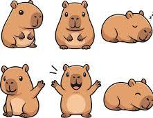

```html
<!DOCTYPE html>
<html lang="fr">

<head>

<meta charset="UTF-8">

<meta name="viewport"
content="width=device-width, initial-scale=1.0">

<title>Coin Rush</title>

<style>

/* =========================
   GENERAL
========================= */

* {
    box-sizing: border-box;
}

body {
    margin: 0;
    font-family: Arial, sans-serif;
    background: linear-gradient(135deg, #17172b, #34205a);
    color: white;
    text-align: center;
}

.game {
    max-width: 520px;
    margin: auto;
    padding: 15px;
}

.card {
    background: #25253d;
    border-radius: 20px;
    padding: 15px;
    margin: 12px 0;
}


/* =========================
   STATS
========================= */

.stats {
    display: flex;
    gap: 10px;
}

.stat {
    flex: 1;
    background: #151525;
    padding: 12px;
    border-radius: 15px;
    font-size: 20px;
    font-weight: bold;
}


/* =========================
   ANIMAL
========================= */

.animalArea {
    height: 280px;
    background: linear-gradient(#8bdcff, #e7fbff);
    border-radius: 18px;
    position: relative;

    display: flex;
    align-items: center;
    justify-content: center;

    overflow: hidden;
}

.animal {
    width: 180px;
    height: 180px;

    object-fit: contain;

    user-select: none;
    pointer-events: none;

    transition: transform 0.25s ease;
}


/* Taille selon l'âge */

.bebe {
    transform: scale(0.75);
}

.enfant {
    transform: scale(0.85);
}

.ado {
    transform: scale(0.95);
}

.adulte {
    transform: scale(1.05);
}


/* =========================
   ANIMATION MANGER
========================= */

.animal.eating {
    animation: eating 0.55s ease;
}

@keyframes eating {

    0% {
        transform: scale(1);
    }

    20% {
        transform: scale(1.12) rotate(-5deg);
    }

    40% {
        transform: scale(0.92) rotate(5deg);
    }

    60% {
        transform: scale(1.10) rotate(-3deg);
    }

    80% {
        transform: scale(1.04) rotate(2deg);
    }

    100% {
        transform: scale(1);
    }
}


/* =========================
   ANIMATION HEUREUX
========================= */

.animal.happy {
    animation: happy 0.8s ease;
}

@keyframes happy {

    0% {
        transform: scale(1);
    }

    30% {
        transform: scale(1.15) translateY(-10px);
    }

    60% {
        transform: scale(1.08);
    }

    100% {
        transform: scale(1);
    }
}


/* =========================
   COOKIE
========================= */

.cookie {
    position: absolute;

    font-size: 45px;

    cursor: pointer;

    z-index: 5;

    opacity: 1;

    transform: scale(1) rotate(0deg);

    transition:
        opacity 0.4s ease,
        transform 0.45s cubic-bezier(.2,.8,.2,1);
}

.cookie.disappearing {

    opacity: 0;

    transform:
        scale(0.15)
        rotate(50deg);

    pointer-events: none;
}

.cookie.hidden {
    display: none;
}


/* =========================
   +1 +2 +3
========================= */

.plusOne {

    position: absolute;

    font-size: 32px;

    font-weight: bold;

    color: #20c95c;

    text-shadow:
        0 2px 4px #0008;

    pointer-events: none;

    z-index: 20;

    animation:
        plusAnimation
        0.85s
        ease-out
        forwards;
}

@keyframes plusAnimation {

    0% {
        opacity: 0;

        transform:
            translate(-50%,20px)
            scale(0.6);
    }

    20% {
        opacity: 1;

        transform:
            translate(-50%,0)
            scale(1.2);
    }

    100% {
        opacity: 0;

        transform:
            translate(-50%,-75px)
            scale(1);
    }
}


/* =========================
   COEUR
========================= */

.heart {

    position: absolute;

    font-size: 35px;

    pointer-events: none;

    animation:
        heartAnimation
        1s
        forwards;
}

@keyframes heartAnimation {

    0% {
        opacity: 1;

        transform:
            translateY(10px)
            scale(0.6);
    }

    50% {
        opacity: 1;

        transform:
            translateY(-40px)
            scale(1.2);
    }

    100% {
        opacity: 0;

        transform:
            translateY(-90px)
            scale(1);
    }
}


/* =========================
   PROGRESSION
========================= */

.progress {

    height: 15px;

    background: #111;

    border-radius: 10px;

    overflow: hidden;

    margin: 10px 0;
}

.progressBar {

    height: 100%;

    width: 0%;

    background: #ffd43b;

    transition:
        width 0.3s ease;
}


/* =========================
   BOUTONS
========================= */

button {

    width: 100%;

    border: none;

    border-radius: 14px;

    padding: 14px;

    margin: 5px 0;

    font-size: 16px;

    font-weight: bold;

    cursor: pointer;

    background: #454563;

    color: white;
}

button:disabled {

    opacity: 0.5;

    cursor: not-allowed;
}

.mainButton {

    background: #ffd43b;

    color: #171717;

    font-size: 20px;
}


/* =========================
   AUTRES
========================= */

.item {

    background: #191929;

    padding: 12px;

    border-radius: 15px;

    margin: 8px 0;
}

.status {

    min-height: 25px;

    font-weight: bold;
}

.small {

    font-size: 13px;

    opacity: 0.8;
}

.locked {

    opacity: 0.55;
}

.hidden {

    display: none !important;
}


/* =========================
   EFFETS
========================= */

.gold {
    animation: gold 0.45s;
}

@keyframes gold {

    50% {

        box-shadow:
            0 0 30px gold,
            0 0 60px gold;
    }
}

.diamond {
    animation: diamond 0.5s;
}

@keyframes diamond {

    50% {

        box-shadow:
            0 0 30px cyan,
            0 0 60px white;
    }
}

.rainbow {
    animation: rainbow 0.6s;
}

@keyframes rainbow {

    0% {
        box-shadow: 0 0 20px red;
    }

    25% {
        box-shadow: 0 0 30px orange;
    }

    50% {
        box-shadow: 0 0 35px lime;
    }

    75% {
        box-shadow: 0 0 35px cyan;
    }

    100% {
        box-shadow: 0 0 20px violet;
    }
}

.galaxy {
    animation: galaxy 0.6s;
}

@keyframes galaxy {

    50% {

        box-shadow:
            0 0 35px violet,
            0 0 70px purple;
    }
}

.lightning {
    animation: lightning 0.5s;
}

@keyframes lightning {

    25% {
        box-shadow: 0 0 35px white;
    }

    50% {
        box-shadow: 0 0 60px cyan;
    }

    75% {
        box-shadow: 0 0 35px white;
    }
}

.lava {
    animation: lava 0.5s;
}

@keyframes lava {

    50% {

        box-shadow:
            0 0 35px orange,
            0 0 70px red;
    }
}

</style>

</head>


<body>


<div class="game">


<h1>🪙 Coin Rush</h1>


<!-- =========================
     STATS
========================= -->

<div class="card stats">

    <div class="stat">

        🪙
        <span id="coins">
            0
        </span>

    </div>


    <div class="stat">

        <span id="fruitIcon">
            🍎
        </span>

        <span id="fruit">
            0
        </span>

    </div>

</div>


<!-- =========================
     ANIMAL
========================= -->

<div class="card">


<h2 id="worldTitle">

🌍 Monde 1 — 🐹 Capybara

</h2>


<div
    class="animalArea"
    id="animalArea"
>





<div
    id="cookie"
    class="cookie hidden"
>
🍪
</div>


</div>


<p>

Niveau

<b>

<span id="level">
1
</span>

</b>

/<span id="maxLevel">
50
</span>

</p>


<div class="progress">

<div
    id="progressBar"
    class="progressBar"
></div>

</div>


<p class="small">

<span id="need">
40
</span>

<span id="needIcon">
🍎
</span>

pour le prochain niveau

</p>


</div>


<!-- =========================
     BOUTON
========================= -->

<div class="card">


<button
    id="clickButton"
    class="mainButton"
>

👆 CLIQUER

</button>


<div
    id="status"
    class="status"
></div>


</div>


<!-- =========================
     BOUTIQUE MONDE 1
========================= -->

<div
    id="shop1"
    class="card"
>


<h2>
🛒 Objets — Monde 1
</h2>


<div class="item">

<b>
🟡 Clic Gold
</b>

<p>
50 🪙 → 2 🍎 par clic
</p>

<p>
Effet doré ✨
</p>

<button
onclick="buyClick('gold',50)"
>
Acheter / utiliser
</button>

<div id="goldUpgrade"></div>

</div>


<div class="item">

<b>
💎 Clic Diamond
</b>

<p>
100 🪙 → 3 🍎 par clic
</p>

<p>
Effet diamant 💎
</p>

<button
onclick="buyClick('diamond',100)"
>
Acheter / utiliser
</button>

<div id="diamondUpgrade"></div>

</div>


<div class="item">

<b>
🤖 Auto Clicker
</b>

<p>
500 🪙 → 2 🍎 par seconde
</p>

<button
onclick="buyAuto('auto1',500)"
>
Acheter / utiliser
</button>

<div id="auto1Upgrade"></div>

</div>


<div class="item">

<b>
🌈 Clic Rainbow
</b>

<p>
750 🪙 → 10 🍎 par clic
</p>

<p>
+5 🍎 par seconde
</p>

<p>
Effet rainbow 🌈
</p>

<button
onclick="buyClick('rainbow',750)"
>
Acheter / utiliser
</button>

<div id="rainbowUpgrade"></div>

</div>


</div>


<!-- =========================
     MONDES
========================= -->

<div class="card">


<h2>
🌍 Mondes
</h2>


<div class="item">

<h3>
🌍 Monde 1 — 🐹
</h3>

<p>
Capybara — 50 niveaux
</p>

</div>


<div
    id="world2Card"
    class="item locked"
>


<h3>
🔒 Monde 2 — 🐼
</h3>


<p id="world2Text">

Atteins le niveau 50 du Capybara.

</p>


<button
    id="world2Button"
    disabled
    onclick="goWorld2()"
>

🔒 Niveau 50 requis

</button>


</div>


<div class="item locked">

<h3>
🔒 Monde 3 — 🦎
</h3>

<p>
Axolote
</p>

<b>
Bientôt disponible
</b>

</div>


</div>


<!-- =========================
     BOUTIQUE MONDE 2
========================= -->

<div
    id="shop2"
    class="card hidden"
>


<h2>
🌍 Monde 2 — 🐼 Panda
</h2>


<div class="item">

<b>
🌌 Clic Galaxie
</b>

<p>
1 500 🪙 → 50 🎋 par clic
</p>

<p>
Effet galaxie violet 🟣
</p>

<button
onclick="buyClick('galaxy',1500)"
>
Acheter / utiliser
</button>

<div id="galaxyUpgrade"></div>

</div>


<div class="item">

<b>
⚡ Clic Foudre
</b>

<p>
6 000 🪙 → 100 🎋 par clic
</p>

<p>
Effet éclair ⚡
</p>

<button
onclick="buyClick('lightning',6000)"
>
Acheter / utiliser
</button>

<div id="lightningUpgrade"></div>

</div>


<div class="item">

<b>
🌋 Clic Volcan
</b>

<p>
50 000 🪙 → 180 🎋 par clic
</p>

<p>
Effet lave 🔥
</p>

<button
onclick="buyClick('volcano',50000)"
>
Acheter / utiliser
</button>

<div id="volcanoUpgrade"></div>

</div>


<div class="item">

<b>
🤖 Auto Clicker
</b>

<p>
100 000 🪙 → 300 🎋 par seconde
</p>

<button
onclick="buyAuto('auto2',100000)"
>
Acheter / utiliser
</button>

<div id="auto2Upgrade"></div>

</div>


</div>


</div>


<script>


/* =====================================================
   SAUVEGARDE
===================================================== */

let saveData =
    JSON.parse(
        localStorage.getItem(
            "coinRush"
        )
    );


if (!saveData) {

    saveData = {

        coins: 0,

        world: 1,

        fruit: 0,

        level: 1,

        progress: 0,

        clickType: "normal",

        owned: {},

        upgrades: {}

    };

}


/* Sécurité */

if (!saveData.owned)
    saveData.owned = {};

if (!saveData.upgrades)
    saveData.upgrades = {};

if (saveData.coins === undefined)
    saveData.coins = 0;

if (saveData.fruit === undefined)
    saveData.fruit = 0;

if (saveData.progress === undefined)
    saveData.progress = 0;

if (saveData.level === undefined)
    saveData.level = 1;


/* =====================================================
   OBJETS
===================================================== */

const items = {

    gold: {
        price: 50,
        power: 2
    },

    diamond: {
        price: 100,
        power: 3
    },

    rainbow: {
        price: 750,
        power: 10
    },

    galaxy: {
        price: 1500,
        power: 50
    },

    lightning: {
        price: 6000,
        power: 100
    },

    volcano: {
        price: 50000,
        power: 180
    }

};


/* =====================================================
   SAUVEGARDER
===================================================== */

function save() {

    localStorage.setItem(
        "coinRush",
        JSON.stringify(
            saveData
        )
    );

}


/* =====================================================
   BESOIN POUR NIVEAU
===================================================== */

function needForLevel(
    level,
    world
) {


    if (world === 1) {


        const values = {

            1: 40,
            2: 60,
            3: 80,
            4: 110,
            5: 150,
            6: 200,
            7: 250,
            8: 300,
            9: 360,
            10: 440,
            11: 560,
            12: 700,
            13: 850,
            14: 1000

        };


        if (values[level]) {

            return values[level];

        }


        return Math.floor(
            1000 *
            Math.pow(
                1.18,
                level - 15
            )
        );

    }


    return Math.floor(
        200 *
        Math.pow(
            1.075,
            level - 1
        )
    );

}


/* =====================================================
   PUISSANCE
===================================================== */

function getClickPower() {


    if (
        saveData.world === 1
    ) {


        if (
            saveData.clickType ===
            "gold"
        )
            return upgradedPower(
                "gold"
            );


        if (
            saveData.clickType ===
            "diamond"
        )
            return upgradedPower(
                "diamond"
            );


        if (
            saveData.clickType ===
            "rainbow"
        )
            return upgradedPower(
                "rainbow"
            );


        return 1;

    }


    if (
        saveData.clickType ===
        "galaxy"
    )
        return upgradedPower(
            "galaxy"
        );


    if (
        saveData.clickType ===
        "lightning"
    )
        return upgradedPower(
            "lightning"
        );


    if (
        saveData.clickType ===
        "volcano"
    )
        return upgradedPower(
            "volcano"
        );


    return 5;

}


/* =====================================================
   PUISSANCE AMÉLIORÉE
===================================================== */

function upgradedPower(
    name
) {


    const base =
        items[name].power;


    const upgrade =
        saveData.upgrades[name] ||
        0;


    if (
        upgrade === 1
    )
        return Math.floor(
            base * 1.5
        );


    if (
        upgrade === 2
    )
        return base * 3;


    if (
        upgrade === 3
    )
        return base * 5;


    return base;

}


/* =====================================================
   AFFICHER +X
===================================================== */

function showPlus(
    amount
) {


    const plus =
        document.createElement(
            "div"
        );


    plus.className =
        "plusOne";


    plus.textContent =
        "+" + amount;


    const area =
        document.getElementById(
            "animalArea"
        );


    plus.style.left =
        (
            area.clientWidth / 2
        ) + "px";


    plus.style.top =
        (
            area.clientHeight / 2
        ) + "px";


    area.appendChild(
        plus
    );


    setTimeout(
        function() {

            plus.remove();

        },
        850
    );

}


/* =====================================================
   ANIMATION ANIMAL
===================================================== */

function animateAnimal() {


    const animal =
        document.getElementById(
            "animal"
        );


    animal.classList.remove(
        "eating"
    );


    animal.classList.remove(
        "happy"
    );


    void animal.offsetWidth;


    animal.classList.add(
        "eating"
    );


    setTimeout(
        function() {


            animal.classList.remove(
                "eating"
            );


            void animal.offsetWidth;


            animal.classList.add(
                "happy"
            );


        },
        500
    );

}


/* =====================================================
   CLIC PRINCIPAL
===================================================== */

document.getElementById(
    "clickButton"
).onclick = function() {


    const amount =
        getClickPower();


    addFruit(
        amount
    );


    showPlus(
        amount
    );


    animateAnimal();


    playEffect();


    document.getElementById(
        "status"
    ).textContent =
        "😋 Miam ! +" +
        amount;


    save();


    update();

};


/* =====================================================
   AJOUTER FRUITS
===================================================== */

function addFruit(
    amount
) {


    saveData.fruit +=
        amount;


    saveData.progress +=
        amount;


    while (true) {


        const max =
            saveData.world === 1
            ? 50
            : 100;


        if (
            saveData.level >= max
        ) {

            saveData.progress = 0;

            break;

        }


        const needed =
            needForLevel(
                saveData.level,
                saveData.world
            );


        if (
            saveData.progress <
            needed
        )
            break;


        saveData.progress -=
            needed;


        saveData.level++;


        /* UN SEUL COEUR */

        createHeart();


        document.getElementById(
            "status"
        ).textContent =
            "🎉 Niveau " +
            saveData.level +
            " ! ❤️";

    }

}


/* =====================================================
   COEUR
===================================================== */

function createHeart() {


    const heart =
        document.createElement(
            "div"
        );


    heart.className =
        "heart";


    heart.textContent =
        "❤️";


    const area =
        document.getElementById(
            "animalArea"
        );


    heart.style.left =
        (
            30 +
            Math.random() * 40
        ) + "%";


    heart.style.top =
        (
            45 +
            Math.random() * 20
        ) + "%";


    area.appendChild(
        heart
    );


    setTimeout(
        function() {

            heart.remove();

        },
        1000
    );

}


/* =====================================================
   EFFETS
===================================================== */

function playEffect() {


    const button =
        document.getElementById(
            "clickButton"
        );


    button.className =
        "mainButton";


    void button.offsetWidth;


    const type =
        saveData.clickType;


    if (type === "gold")
        button.classList.add(
            "gold"
        );


    if (type === "diamond")
        button.classList.add(
            "diamond"
        );


    if (type === "rainbow")
        button.classList.add(
            "rainbow"
        );


    if (type === "galaxy")
        button.classList.add(
            "galaxy"
        );


    if (type === "lightning")
        button.classList.add(
            "lightning"
        );


    if (type === "volcano")
        button.classList.add(
            "lava"
        );

}


/* =====================================================
   ACHETER CLIC
===================================================== */

function buyClick(
    name,
    price
) {


    if (
        saveData.owned[name]
    ) {


        saveData.clickType =
            name;


        document.getElementById(
            "status"
        ).textContent =
            "✅ " +
            name +
            " sélectionné";


        save();

        update();

        return;

    }


    if (
        saveData.coins <
        price
    ) {


        document.getElementById(
            "status"
        ).textContent =
            "❌ Pas assez de 🪙 coins";


        return;

    }


    saveData.coins -=
        price;


    saveData.owned[name] =
        true;


    saveData.clickType =
        name;


    document.getElementById(
        "status"
    ).textContent =
        "🎉 Objet acheté !";


    save();

    update();

}


/* =====================================================
   AUTO CLICKER
===================================================== */

function buyAuto(
    name,
    price
) {


    if (
        saveData.owned[name]
    ) {


        document.getElementById(
            "status"
        ).textContent =
            "🤖 Auto Clicker déjà acheté";


        return;

    }


    if (
        saveData.coins <
        price
    ) {


        document.getElementById(
            "status"
        ).textContent =
            "❌ Pas assez de 🪙 coins";


        return;

    }


    saveData.coins -=
        price;


    saveData.owned[name] =
        true;


    document.getElementById(
        "status"
    ).textContent =
        "🤖 Auto Clicker acheté !";


    save();

    update();

}


/* =====================================================
   AMÉLIORER CLIC
===================================================== */

function upgradeClick(
    name
) {


    if (
        !saveData.owned[name]
    )
        return;


    const current =
        saveData.upgrades[name] ||
        0;


    if (
        current >= 3
    )
        return;


    let multiplier;


    if (
        current === 0
    )
        multiplier = 0.95;

    else if (
        current === 1
    )
        multiplier = 2;

    else
        multiplier = 5;


    const price =
        Math.floor(
            items[name].price *
            multiplier
        );


    if (
        saveData.coins <
        price
    ) {


        document.getElementById(
            "status"
        ).textContent =
            "❌ Pas assez de 🪙 coins";


        return;

    }


    saveData.coins -=
        price;


    saveData.upgrades[name] =
        current + 1;


    document.getElementById(
        "status"
    ).textContent =
        "⬆️ Amélioration achetée !";


    save();

    update();

}


/* =====================================================
   AMÉLIORER AUTO
===================================================== */

function upgradeAuto(
    name,
    price
) {


    if (
        !saveData.owned[name]
    )
        return;


    const current =
        saveData.upgrades[name] ||
        0;


    if (
        current >= 3
    )
        return;


    let multiplier;


    if (
        current === 0
    )
        multiplier = 0.95;

    else if (
        current === 1
    )
        multiplier = 2;

    else
        multiplier = 5;


    const upgradePrice =
        Math.floor(
            price *
            multiplier
        );


    if (
        saveData.coins <
        upgradePrice
    ) {


        document.getElementById(
            "status"
        ).textContent =
            "❌ Pas assez de 🪙 coins";


        return;

    }


    saveData.coins -=
        upgradePrice;


    saveData.upgrades[name] =
        current + 1;


    document.getElementById(
        "status"
    ).textContent =
        "⬆️ Auto amélioré !";


    save();

    update();

}


/* =====================================================
   AFFICHER AMÉLIORATIONS
===================================================== */

function showUpgrade(
    name,
    price,
    elementId,
    auto = false
) {


    const element =
        document.getElementById(
            elementId
        );


    if (
        !saveData.owned[name]
    ) {

        element.innerHTML = "";

        return;

    }


    const level =
        saveData.upgrades[name] ||
        0;


    if (
        level >= 3
    ) {

        element.innerHTML =
            "<p>✅ Niveau maximum</p>";

        return;

    }


    let multiplier;


    if (
        level === 0
    )
        multiplier = 0.95;

    else if (
        level === 1
    )
        multiplier = 2;

    else
        multiplier = 5;


    const upgradePrice =
        Math.floor(
            price *
            multiplier
        );


    const nextPower =
        level === 0
        ? "×1,5"
        : level === 1
        ? "×3"
        : "×5";


    if (auto) {


        element.innerHTML =

            "<button onclick=\"upgradeAuto('" +
            name +
            "'," +
            price +
            ")\">" +

            "⬆️ Amélioration " +
            (level + 1) +
            " — " +
            upgradePrice +
            " 🪙 — " +
            nextPower +

            "</button>";

    }

    else {


        element.innerHTML =

            "<button onclick=\"upgradeClick('" +
            name +
            "')\">" +

            "⬆️ Amélioration " +
            (level + 1) +
            " — " +
            upgradePrice +
            " 🪙 — " +
            nextPower +

            "</button>";

    }

}


/* =====================================================
   MONDE 2
===================================================== */

function goWorld2() {


    if (
        saveData.world === 1 &&
        saveData.level >= 50
    ) {


        saveData.world = 2;


        saveData.fruit = 0;


        saveData.progress = 0;


        saveData.level = 1;


        saveData.clickType =
            "normal";


        saveData.owned = {};


        saveData.upgrades = {};


        document.getElementById(
            "status"
        ).textContent =
            "🐼 Bienvenue dans le Monde 2 !";


        save();

        update();

    }

}


/* =====================================================
   COOKIE
===================================================== */

function spawnCookie() {


    const cookie =
        document.getElementById(
            "cookie"
        );


    cookie.classList.remove(
        "hidden"
    );


    cookie.classList.remove(
        "disappearing"
    );


    const area =
        document.getElementById(
            "animalArea"
        );


    const maxX =
        area.clientWidth - 55;


    const maxY =
        area.clientHeight - 65;


    cookie.style.left =
        Math.max(
            5,
            Math.random() * maxX
        ) + "px";


    cookie.style.top =
        Math.max(
            5,
            Math.random() * maxY
        ) + "px";

}


/* =====================================================
   COOKIE CLICK
===================================================== */

document.getElementById(
    "cookie"
).onclick = function(event) {


    event.stopPropagation();


    if (
        this.classList.contains(
            "disappearing"
        )
    )
        return;


    const bonus =
        getClickPower() * 2;


    showPlus(
        bonus
    );


    addFruit(
        bonus
    );


    this.classList.add(
        "disappearing"
    );


    animateAnimal();


    document.getElementById(
        "status"
    ).textContent =
        "🍪 +" +
        bonus +
        " ! Miam 😋";


    save();

    update();


    setTimeout(
        () => {

            this.classList.add(
                "hidden"
            );

            this.classList.remove(
                "disappearing"
            );

        },
        450
    );


    setTimeout(
        spawnCookie,
        20000
    );

};


/* Premier cookie */

setTimeout(
    spawnCookie,
    5000
);


/* =====================================================
   AUTO CLICKERS
===================================================== */

setInterval(
    function() {


        let amount = 0;


        if (
            saveData.world === 1
        ) {


            if (
                saveData.owned.auto1
            ) {


                let multiplier = 1;


                const u =
                    saveData.upgrades.auto1 ||
                    0;


                if (
                    u === 1
                )
                    multiplier = 1.5;


                if (
                    u === 2
                )
                    multiplier = 3;


                if (
                    u === 3
                )
                    multiplier = 5;


                amount +=
                    2 *
                    multiplier;

            }


            if (
                saveData.owned.rainbow
            ) {

                amount += 5;

            }

        }


        else {


            if (
                saveData.owned.auto2
            ) {


                let multiplier = 1;


                const u =
                    saveData.upgrades.auto2 ||
                    0;


                if (
                    u === 1
                )
                    multiplier = 1.5;


                if (
                    u === 2
                )
                    multiplier = 3;


                if (
                    u === 3
                )
                    multiplier = 5;


                amount +=
                    300 *
                    multiplier;

            }

        }


        if (
            amount > 0
        ) {


            addFruit(
                amount
            );


            save();

            update();

        }


    },
    1000
);


/* =====================================================
   MISE À JOUR
===================================================== */

function update() {


    document.getElementById(
        "coins"
    ).textContent =
        Math.floor(
            saveData.coins
        );


    document.getElementById(
        "fruit"
    ).textContent =
        Math.floor(
            saveData.fruit
        );


    document.getElementById(
        "level"
    ).textContent =
        saveData.level;


    const max =
        saveData.world === 1
        ? 50
        : 100;


    document.getElementById(
        "maxLevel"
    ).textContent =
        max;


    /* =====================
       MONDE 1
    ===================== */

    if (
        saveData.world === 1
    ) {


        document.getElementById(
            "worldTitle"
        ).textContent =
            "🌍 Monde 1 — 🐹 Capybara";


        document.getElementById(
            "animal"
        ).src =
            "IMG_1419.jpeg";


        document.getElementById(
            "fruitIcon"
        ).textContent =
            "🍎";


        document.getElementById(
            "needIcon"
        ).textContent =
            "🍎";


        document.getElementById(
            "shop1"
        ).classList.remove(
            "hidden"
        );


        document.getElementById(
            "shop2"
        ).classList.add(
            "hidden"
        );

    }


    /* =====================
       MONDE 2
    ===================== */

    else {


        document.getElementById(
            "worldTitle"
        ).textContent =
            "🌍 Monde 2 — 🐼 Panda";


        document.getElementById(
            "animal"
        ).src =
            "IMG_1420.jpeg";


        document.getElementById(
            "fruitIcon"
        ).textContent =
            "🎋";


        document.getElementById(
            "needIcon"
        ).textContent =
            "🎋";


        document.getElementById(
            "shop1"
        ).classList.add(
            "hidden"
        );


        document.getElementById(
            "shop2"
        ).classList.remove(
            "hidden"
        );

    }


    /* =====================
       STADE ANIMAL
    ===================== */

    const animal =
        document.getElementById(
            "animal"
        );


    /*
       IMPORTANT :
       On ne touche PAS aux
       classes eating / happy.
    */

    animal.classList.remove(
        "bebe",
        "enfant",
        "ado",
        "adulte"
    );


    if (
        saveData.level <= 5
    ) {

        animal.classList.add(
            "bebe"
        );

    }

    else if (
        saveData.level <= 10
    ) {

        animal.classList.add(
            "enfant"
        );

    }

    else if (
        saveData.level <= 25
    ) {

        animal.classList.add(
            "ado"
        );

    }

    else {

        animal.classList.add(
            "adulte"
        );

    }


    /* =====================
       PROGRESSION
    ===================== */

    if (
        saveData.level >= max
    ) {


        document.getElementById(
            "need"
        ).textContent =
            "MAX";


        document.getElementById(
            "progressBar"
        ).style.width =
            "100%";

    }

    else {


        const needed =
            needForLevel(
                saveData.level,
                saveData.world
            );


        document.getElementById(
            "need"
        ).textContent =
            needed;


        document.getElementById(
            "progressBar"
        ).style.width =
            Math.min(
                100,
                saveData.progress /
                needed *
                100
            ) + "%";

    }


    /* =====================
       MONDE 2
    ===================== */

    if (
        saveData.world === 1 &&
        saveData.level >= 50
    ) {


        document.getElementById(
            "world2Button"
        ).disabled =
            false;


        document.getElementById(
            "world2Button"
        ).textContent =
            "🌍 Entrer dans le Monde 2";


        document.getElementById(
            "world2Card"
        ).classList.remove(
            "locked"
        );


        document.getElementById(
            "world2Text"
        ).textContent =
            "🎉 Monde 2 débloqué !";

    }


    /* =====================
       AMÉLIORATIONS
    ===================== */

    showUpgrade(
        "gold",
        50,
        "goldUpgrade"
    );


    showUpgrade(
        "diamond",
        100,
        "diamondUpgrade"
    );


    showUpgrade(
        "rainbow",
        750,
        "rainbowUpgrade"
    );


    showUpgrade(
        "auto1",
        500,
        "auto1Upgrade",
        true
    );


    showUpgrade(
        "galaxy",
        1500,
        "galaxyUpgrade"
    );


    showUpgrade(
        "lightning",
        6000,
        "lightningUpgrade"
    );


    showUpgrade(
        "volcano",
        50000,
        "volcanoUpgrade"
    );


    showUpgrade(
        "auto2",
        100000,
        "auto2Upgrade",
        true
    );

}


/* =====================================================
   DÉMARRAGE
===================================================== */

update();

save();

</script>

</body>
</html>
```
